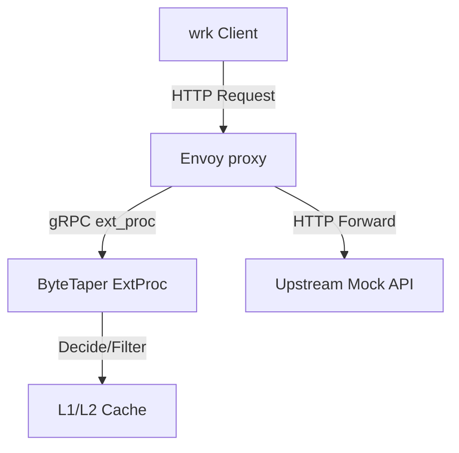

# ByteTaper Production Benchmarking & Readiness Guide

This guide provides step-by-step instructions for executing, validating, and interpreting ByteTaper performance benchmarks. It serves as a blueprint for attaching reproducible benchmarks to production readiness reviews (PRRs).

---

## 🚀 Architecture Overview

ByteTaper sits as an external processor stream filter beside your Envoy sidecars/gateways. To guarantee that ByteTaper operates with zero performance regressions and maximum hardware utilization, our performance pipeline isolates and compares:
1. **Envoy-Only Baseline**: The standard Envoy routing path with the external processor disabled.
2. **ByteTaper Candidate**: The complete active external processing pipeline (observe, filtering, caching, compression, pagination, and request coalescing).



---

## 📈 Scenario Matrix & Execution Commands

All benchmarks run inside a dedicated, isolated Docker container (`bytetaper-benchmark`) to eliminate hardware disparities and ensure full reproducibility. No local tools are required.

To run any benchmark scenario, use:
```bash
docker compose run --rm bytetaper-benchmark ./benchmarks/scenarios/<scenario>.sh
```

### 1. Performance Smoke Test (`performance_smoke.sh`)
- **Purpose**: Rapid 3-second check designed for CI pull request gates.
- **Goal**: Catch obvious regressions early without prolonged resource lockup.

### 2. Envoy-Only Baseline (`envoy_only.sh`)
- **Purpose**: Standardize the pure Envoy network forwarding latency and throughput.
- **Goal**: Serve as the reference point for all overhead calculations.

### 3. Observe Mode (`bytetaper_observe.sh`)
- **Purpose**: Measure ByteTaper gRPC stream initialization and framing costs with transparent passthrough.
- **Goal**: Keep transit framing cost below 5ms overhead.

### 4. Field Filtering (`bytetaper_field_filtering.sh`)
- **Purpose**: Measure JSON payload pruning cost.
- **Goal**: Evaluate CPU compression gains vs processing latencies.

### 5. Cache Promotion (`cache_hit.sh`)
- **Purpose**: Measure L2-to-L1 promotions and immediate L1 cached memory-speed lookups.
- **Goal**: Validate sub-millisecond cached responses.

### 6. Pagination Guardrail (`pagination_guardrail.sh`)
- **Purpose**: Verify default pagination overrides and maximum payload boundaries.
- **Goal**: Prevent oversized responses from exhausting sidecar memory.

### 7. Compression Coordination (`compression_coordination.sh`)
- **Purpose**: Evaluate CPU cost trade-offs of compressing large JSON payloads dynamically.
- **Goal**: Verify network transfer savings balance processing overhead.

### 8. Request Coalescing (`coalescing_burst.sh`)
- **Purpose**: Measure GET request deduplication under high-concurrency burst conditions.
- **Goal**: Prove downstream database protection factors.

---

## ⏱️ Metric Interpretations

### Latency Percentiles (P50, P95, P99)
- **P50 (Median)**: Represents the typical user experience.
- **P95 / P99 (Tail Latency)**: Vital for SLA compliance. High tail latency indicates lock contention, memory thrashing, or garbage collection spikes in the hot path. 
- **Validation**:
  > [!IMPORTANT]
  > When evaluating ByteTaper, ensure that the candidate's P95 latency overhead compared to Envoy-only baseline remains under the maximum safety thresholds (typically **160ms** for general operations).

### Payload Savings Calculation
We measure payload efficiency via Average Original Bytes vs Optimized Bytes.
- **Payload Savings (Bytes)** = `Original_Bytes_Avg - Optimized_Bytes_Avg`
- **Reduction Ratio** = `(Payload_Savings / Original_Bytes_Avg) * 100`

### Container Resource Metrics
Tracks container-level peak CPU percentages and resident set memory allocations.
- **Known Limitation**: In isolated virtual execution runtimes (e.g. CI environments with restricted host cgroup namespaces), the Docker metrics socket may return `unavailable`.
- **Validation Fallback**:
  > [!NOTE]
  > When cgroup statistics are unavailable, the benchmarking scripts gracefully log the status as `unavailable` without failing, preserving test integrity.

---

## ⚠️ Performance Regression Guardrails

Every benchmark execution automatically validates metrics against safety ceilings specified in `benchmarks/performance-thresholds.yaml`. If any parameter crosses its threshold, the validation script `check_thresholds.sh` returns a **non-zero exit code (1)**, failing CI/CD builds instantly.

---

## 📝 Production Readiness Review (PRR) Checklist

Before rolling out any ByteTaper update to production environments:
1. Run a comprehensive baseline test:
   ```bash
   docker compose run --rm bytetaper-benchmark ./benchmarks/scenarios/bytetaper_observe.sh
   ```
2. Retrieve the stylized executive Markdown report from `reports/benchmarks/`:
   ```bash
   cat reports/benchmarks/benchmark_results_*.md
   ```
3. Attach both the machine-readable `.json` data report and the executive `.md` report to the Production Readiness ticket.
4. Ensure the threshold validation exited zero:
   ```text
   === Threshold Validation PASSED (all checks succeeded) ===
   ```
